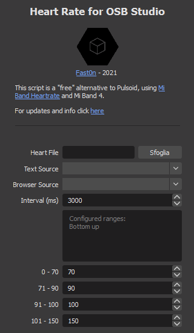

# Heartrate for OBS Studio

This script is a "free" alternative to Pulsoid, using the file generated by
<a href="https://github.com/Eryux/miband-heartrate">Mi Band Heartrate</a> and Mi Band 4.

## Four different colors according to the frequency

